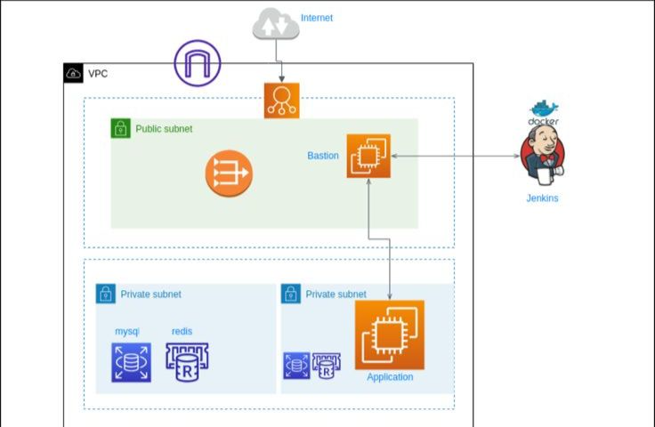
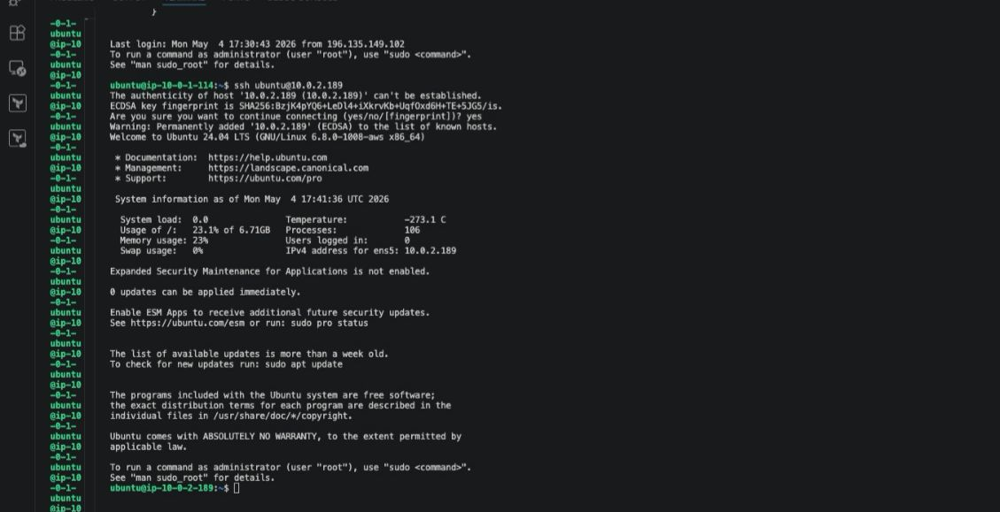
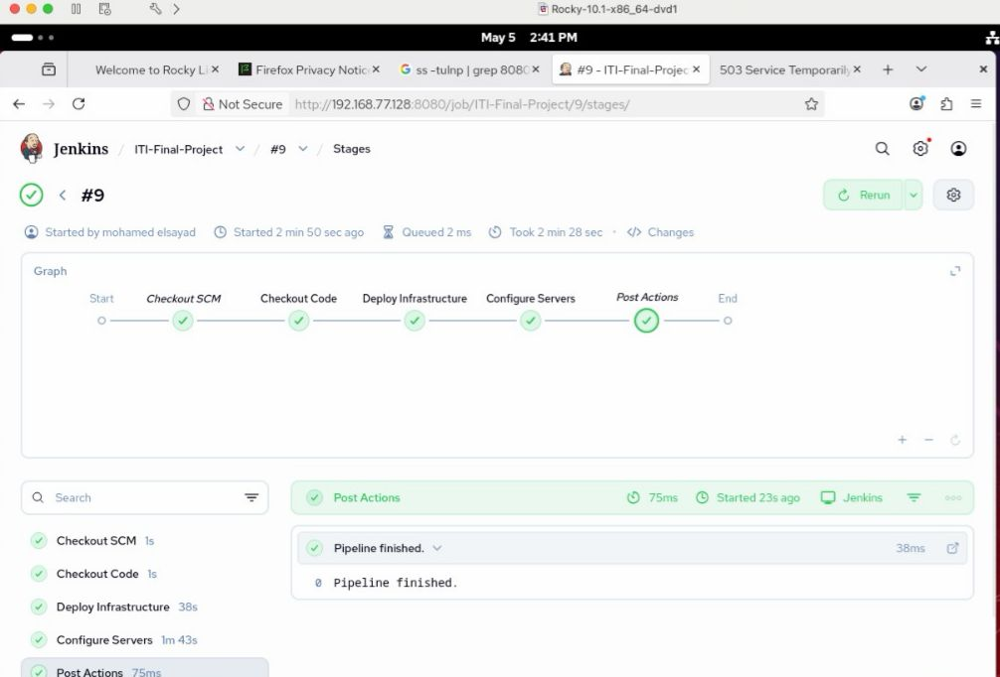
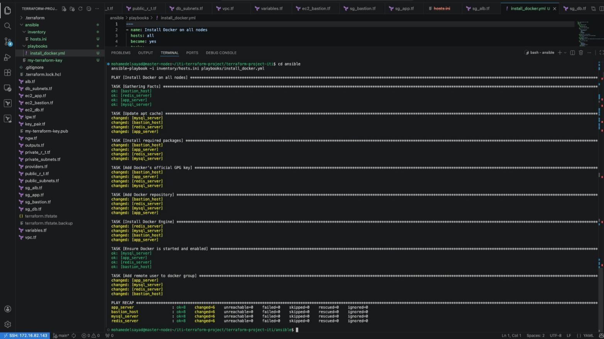
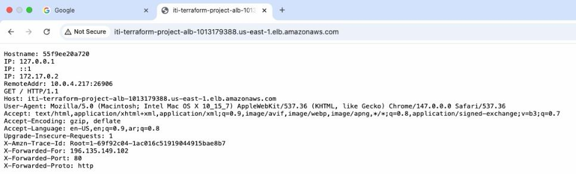
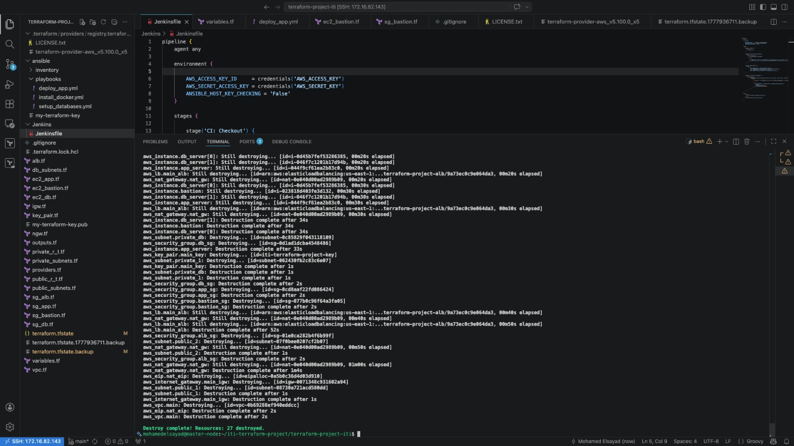

# 🚀 AWS Automated Infrastructure: From Zero to Production

## 📌 Project Overview
This repository showcases a complete **CI/CD and Infrastructure as Code (IaC)** lifecycle. I developed this project to demonstrate the deployment of a secure, multi-tier environment on AWS using industry-standard tools. It highlights the transition from manual configuration to a fully automated "Disposable Infrastructure" model.

---

## 🏗️ Architecture Design



The design follows a "Security-First" approach to protect internal resources:
*   **VPC Customization:** High-availability networking with Public and Private Subnets.
*   **The Bastion Strategy:** All application and database nodes are isolated in Private Subnets. Administrative access is managed strictly via a **Bastion Host (Jump Box)** using SSH tunneling.
*   **Load Balancing:** An **AWS Application Load Balancer (ALB)** serves as the single entry point for user traffic, distributing it to the backend fleet.
*   **Data Tier:** Automated provisioning of **RDS (MySQL)** and **Redis** for structured data and caching.


---

## 🛠️ Technical Stack
*   **Cloud Provider:** AWS (EC2, VPC, ALB, RDS, Redis)
*   **Infrastructure as Code:** Terraform
*   **Configuration Management:** Ansible
*   **CI/CD Orchestration:** Jenkins
*   **Containerization:** Docker
*   **OS Environments:** Ubuntu 24.04 LTS & 20.04 LTS

---

## 📸 Deployment & Execution Milestones

### 1. Infrastructure Provisioning (Terraform)
The environment is defined entirely in code. Terraform builds the networking, security groups, and 17+ resources in a single execution.
> **Status:** Success


### 2. CI/CD Orchestration (Jenkins)
I implemented a **Declarative Pipeline** to manage the lifecycle of the code. This ensures that every commit triggers a build, infrastructure check, and configuration update.
> **Status:** Pipeline Green


### 3. Configuration Management (Ansible)
Ansible playbooks handle the "Day 2" operations, including installing the Docker engine and setting up the environment across private nodes via the Bastion tunnel.
> **Status:** All Tasks Changed/OK


### 4. Verification & Live Site
The project concludes with a functional, load-balanced application. The final output verifies that the ALB is correctly routing traffic to the internal private nodes.
> **Status:** Site Live


---

## 🛠️ Challenges & Troubleshooting
As a **Junior Cloud DevOps Engineer**, this project involved solving several real-world technical hurdles:
*   **SSH ProxyCommand:** I successfully configured Ansible to communicate with isolated private instances by routing traffic through the Bastion Host, preventing any direct public exposure.
*   **Unrecognized Arguments:** Debugged complex shell quoting issues within Jenkins to ensure Ansible commands were parsed correctly by the remote nodes.
*   **Resource Cleanup:** Implemented a robust `destroy` phase to ensure all AWS resources are terminated cleanly, maintaining a cost-efficient environment.


---

## 🚀 How to Replicate
1. **Prerequisites:** Ensure AWS CLI is configured with valid IAM credentials.
2. **IaC Deployment:**
   ```bash
   cd terraform/
   terraform init
   terraform apply -auto-approve